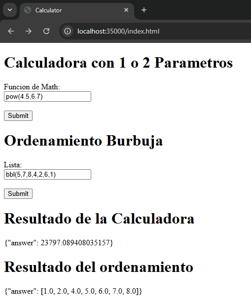

### Instrucciones para Ejecutar

- Clonar en repositorio:
    git clone https://github.com/CristianAlvarez-b/AREP-Parcial1.git
- Ejecutar el comando:
    mvn clean install
- Iniciar el servidor con el comando:
  java -cp "target/classes" co.edu.escuelaing.arep.parcial.HttpServer
- 
### Pruebas de Funcionamiento
Para poder ingresar al cliente se debe digitar la url
http://localhost:35000/index.html
# Funciones de Math con 1 parametro
Es importante usar el boton de submit al momento de enviar la solicitud

# Funciones de Math con 2 parametros

Es importante user el boton de submit al momento de enviar la peticion

# Ordenar una lista de enteros
Es importante seguit la estructura del ejemplo y utilizar el boton de submit
bbl(num1, num2, num3, ... , numn)

